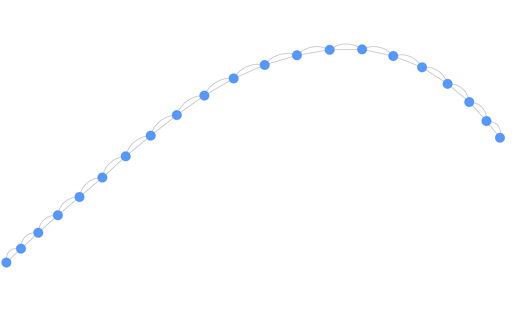

# Juxtapose

<!-- TABLE OF CONTENTS -->
<details open="open">
  <summary>Table of Contents</summary>
  <ol>
    <li>
      <a href="#about-the-project">About The Project</a>
    </li>
    <li>
      <a href="#getting-started">Getting Started</a>
      <ul>
        <li><a href="#prerequisites">Prerequisites</a></li>
        <li><a href="#installation">Installation</a></li>
      </ul>
    </li>
    <li><a href="#usage">Usage</a>
    <ul>
        <li><a href="#Small-network-embedding">Small network embedding</a></li>
        <li><a href="#Large-network-embedding">Large network embedding</a></li>
        <li><a href="#Translating-IDs-to-integers">Translating IDs to integers</a></li>      
     </ul>    
    </li>
    <li><a href="#contributing">Contributing</a></li>
    <li><a href="#versioning">Versioning</a></li>
    <li><a href="#contact">Contact</a></li>
  </ol>
</details>


<!-- ABOUT THE PROJECT -->
## About The Project
<p align="center">

</p>

Welcome to Juxtapose, a Python tool that can be used to compare gene co-expression networks (GCNs). Juxtapose, together with different similarity measures, can be utilized for comparative transcriptomics between a set of organisms. While we focus on its application to comparing co-expression networks across species in evolutionary studies, Juxtapose is also generalizable to co-expression network comparisons across tissues or conditions within the same species. A word embedding strategy commonly used in natural language processing was utilized in order to generate gene embeddings based on walks made throughout the GCNs. 

You may also suggest changes by forking this repo and creating a pull request or opening an issue. 

<!-- GETTING STARTED -->
## Getting Started

The following steps will guide you through the process of running Juxtapose on your local machine or an [AWS spot instance](https://aws.amazon.com/ec2/spot/?cards.sort-by=item.additionalFields.startDateTime&cards.sort-order=asc).

### Prerequisites

The main dependencies of Juxtapose are gensim, scikit-learn, numpy, pandas, and scipy. See requirements.txt for the complete list of requirements.

### Installation

It is a good practice to use a virtual environment for deploying Python programs. Using conda, we can create an environment named juxtapose. The environment name is arbitrary.
 ```sh
  conda create -n juxtapose python=3.6
  ```

After downloading the Juxtapose repository, the following command can be run to install requirements.
```sh
  make setup
  ```
  ### Adding more tests

New tests should be added as modules where their names start with test_ under test directory.

<!-- USAGE EXAMPLES -->
## Usage

In order to run Juxtapose, two JSON files are required containing the desired parameters for (1) creating an anchored network using a set of genes and making walks through this network and (2) running an embedding method to obtain pairwise local distances between genes as well as a global similarity between networks, and results including visualizations from biclustering local pairwise distances. 

### Small network embedding
Let us take an example of embedding a simple line network.

<p align="center">

</p>

We require a csv file that that contains the edge list representation of the network. In our case, we have line_1.csv and line_2.csv.

Content of line_1.csv and line_2.csv:
```sh
0,1,1
1,0,1
1,2,1
2,1,1
2,3,1
3,2,1
3,4,1
4,3,1
4,5,1
5,4,1
5,6,1
6,5,1
6,7,1
7,6,1
7,8,1
8,7,1
8,9,1
9,8,1
9,10,1
10,9,1
  ```
We have the config/JSON files stored in the test/data folder.
The example contents of line-config.json used for adding anchors to the networks:
```sh
{
  "n_replicates": 10,
  "percentage": 0.4,
  "n_anchors": 6,
  "anchor_test_ratio": 0.5,
  "min_dangle_size": 3,
  "max_dangle_size": 10,
  "anchor_file_address": "test/data/line_anchors.csv",
  "phenotypes": ["1", "2"],
  "experiment_name": "Line",
  "data_directory": "test/data"
}
```

The example contents of Line-train-config.json used for model training and visualizations:
```sh
  {
  "experiment_name": "Line",
  "phenotypes": ["1", "2"],
  "walk_per_node": 1000,
  "walk_length": 50,
  "n_iter": 1,
  "n_workers": 20,
  "embd_dim": 10,
  "window": 2,
  "min_count": 2,
  "negatives": 5,
  "alpha": 0.01,
  "n_replicates": 1,
  "min_alpha": 0.001
  }
  ```
To run the anchoring step, we also require the genes/nodes of the network that will be used as the anchor points in the networks that are going to be compared. As the networks will be compared, these synthetic structures that are attached to the real networks should be the same. We have provided line_anchors.csv for this example, but this list can be catered or limited to any sets of nodes a user would like to select as potential anchors. The name of the file used needs to be set in the config file using the "anchor_file_address" parameter.

To add anchor nodes, run the following command.
```sh
python3 dangle.py --config test/data/line-config.json
``` 

To generate the intermediate walk files, if necessary, run the following command.
```sh
python3 dataset_generator.py --config test/data/Line-train-config.json
``` 

Next, runner.py will train the models for each network, calculate the local and global similarity measures between genes and bicluster the local similarity results. If a full co-expression network is used and it is not possible to generate the complete matrix, there is also an option to select only a percentage of each bicluster in order to make a representative visualization. 
```sh
python3 runner.py --config test/data/Line-train-config.json
```
It should also be noted if the models for the networks have already been trained and only the similarity measures and biclustering need to be run, then the option "no-train" can be specified as below when running.
```sh
python3 runner.py --config test/data/Line-train-config.json --no-train
```
We have provided other datasets (circle, cross, heart, and brain) that can be used of various sizes and complexity/density for further testing. All can be found in the test data folder.

### Large networks
It will not always be possible to compare larger networks on many machines due to the large memory requirements as the number of edges in the networks increases. As such, we recommend an AWS spot instance for more affordable resources if no other resources are available to you. In order to set up an instance that will work for a larger network, e.g. 10,000+ genes, one option would be to go to the [EC2 Dashboard](https://aws.amazon.com/ec2/getting-started/) and make a spot request.

Make a spot request.
<p align="center">

</p>

Selecting an AMI. We recommend using Ubuntu Server 18.04 LTS (HVM), SSD Volume Type.

Selecting an instance type.
<p align="center">

</p>

This request will also require a [key pair](https://docs.aws.amazon.com/AWSEC2/latest/UserGuide/ec2-key-pairs.html#having-ec2-create-your-key-pair) and [enabling inbound SSH traffic from your IP address to your instance](https://docs.aws.amazon.com/AWSEC2/latest/UserGuide/authorizing-access-to-an-instance.html). If these have not been set up already, there is the option to create a new key pair and security group below where they are requested in the spot instance template. The remaining parts of the spot request are optional and can be changed according to your needs.

<p align="center">


</p>

Once the instance is created, use ssh to go to the instance. A generic example is provided below.
```sh
ssh -i "keypair.pem" ubuntu@ec2-52-23-241-60.compute-1.amazonaws.com
```
The actual command to ssh to the instance can be obtained using the Amazon EC2 console. Go to Instances and click the Connect button, which will provide the required command.

<p align="center">

</p>

Then the following will need to be run to set up python on the intance.
```sh
sudo apt update
sudo apt install python3-pip
python3 -m pip install --user numpy scipy matplotlib
pip3 install --upgrade gensim
pip3 install seaborn
pip3 install -U scikit-learn
pip3 install torch torchvision
 ```
A [volume](https://docs.aws.amazon.com/AWSEC2/latest/UserGuide/ebs-creating-volume.html) is also required in order to store data and results. The volume will need to be attached to the instance as follows.
<p align="center">


</p>

The volume created to store the data as well as Juxtapose can be attached as follows.
```sh
lsblk # the volume we made is called xvdf
mkdir experiment  # make a directory
chmod -R 744 experiment/  # change its permissions
sudo mount /dev/xvdf experiment/ # mount the volume to the new directory
cd experiment/ # go to the directory and start working
```
After the volume is attached to the spot instance, the code can be downloaded into the folder that has had the volume mounted to it and Juxtapose can be run as was done above with the line network example.

### Translating IDs to integers
There are also options to translate node IDs to integers if they are not in the original networks. Converting the names to integers can save a lot of memory and result in a quicker analysis. The following commands can be used in order to convert names to integers after the anchoring procedure has been completed and all nodes that will be a part of the networks are now included in the anchored network files, i.e. experiment_anchored_*.csv.

```sh
 python3 test_translator.py --config test/data/line-config.json 
 ```
 
 This will produce files named the same as the original anchored networks (translated_anchored_*.csv). Also, a JSON file, IDConvertor.json, will be produced to save the translation between integers and the original IDs. This allows for easy translation bake to the original names or IDs for downstream analyses.
 
 Other means of visualization are available that have not been covered here are included in dimensionality_reduction.py including t-SNE and PCA visualizations of the embedded datasets. Tutorial on how to visualize specific genes as well as the genes closest or furthest from them in the embedding space will be added in the future.
 
 <!-- Versioning -->
## Versioning

We use [Semantic Versioning 2.0.0](http://semver.org/) for versioning.


<!-- CONTACT -->
## Contact

**Katie Ovens** - katie.ovens@usask.ca
Project Link: [https://github.com/klovens/juxtapose](https://github.com/klovens/juxtapose)
